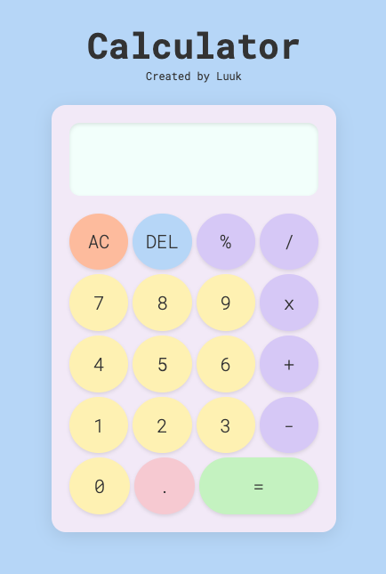

# Calculator
A simple calculator built with HTML, CSS, and JavaScript as part of the final project in the Foundations Course from The Odin Project. This project demonstrates core web development skills including layout design, DOM manipulation, and event handling.

## 📸 Screenshot

## 📂 Live Demo
https://luukdg.github.io/TOP-Calculator/
Live Demo

## 🚀 Features
Basic arithmetic operations: add, subtract, multiply, and divide

Clear display and reset functionality

Responsive design for desktop and mobile

Keyboard support (optional depending on your implementation)

## 🛠 Built With
HTML – Structure and layout

CSS – Styling and responsiveness

JavaScript – Calculator logic and interaction

## 📚 What I Learned
How to structure a basic web project from scratch

DOM manipulation and event listeners in JavaScript

CSS layout techniques like Flexbox or Grid

Planning and organizing functions for logic-based features

## ✅ Assignment
This was the final project in the Foundations section of The Odin Project, a free and open-source curriculum for learning web development.
